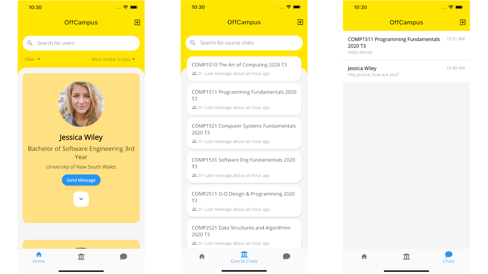
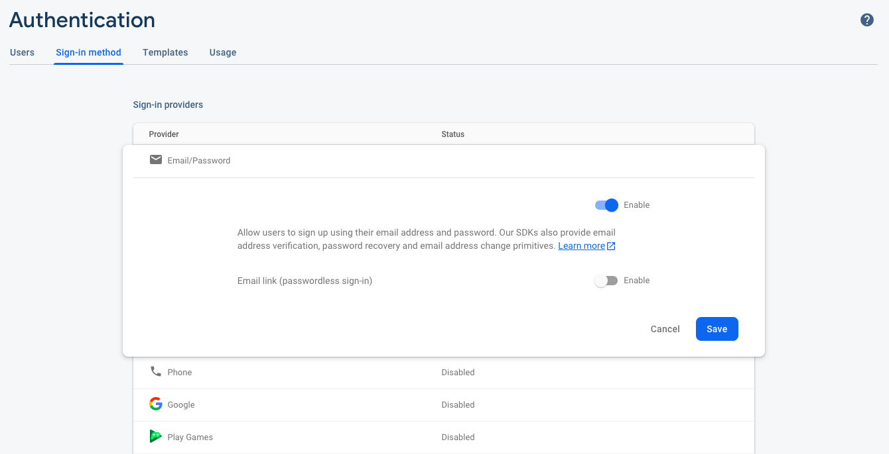

# OffCampus

OffCampus is an essential app for your university life, letting you to meet new friends, and to join course chats to discuss about your courses.

## Background

With all the university courses being moved into an online teaching and learning envionment, students have barely been going to campus, making it almost impossible to meet new friends and very hard to discuss about your courses informally.

OffCampus is a platform for university students to:

- Meet new friends from the same degree or across different universities and faculties
- Find and join course chats to discuss about your enrolled courses (No need to ask for course chats on CSESOC Facebook Group anymore!)
- Chat and send messages with your friends and colleagues

### Built With

- [Flutter](https://flutter.dev/)
- [Firebase](https://firebase.google.com/)

## Getting Started

### Setup Flutter

To install and setup Flutter, follow the instructions [here](https://flutter.dev/docs/get-started/install).

### Setup Firebase

Create a new project on Firebase.

- For iOS, create an iOS app and download the config file `GoogleService-info.plist`, and place it under `ios/Runner/`. 
- For Android, create and Android app and download the config file `google-services.json`, and place it under `android/app/`.

#### Authentication

Enable authentication by going into Authentication > Sign-In method > Email/Password > Enable > save.

#### Cloud Firestore and Storage

Enable Cloud Firestore and Storage by going into the corresponding tabs and select a region.

#### Service Account

Create a service account by going into Settings > Project settings > Service accounts > Firebase Admin SDK > Generate new private key. Rename the file to `keyfile.json` and place it under scripts/.

### Setup Database

We provide some Python scripts to initialise and insert data into Cloud Firestore. The scripts require Python 3.6+. 

Install the required packages with the command below:

    cd scripts/
    pip3 install -r requirements.txt

#### Insert University Data

Currently we have data for University of New South Wales (UNSW) and University of Sydney (USYD). Run the following command to insert the data:

    python3 add_unis.py

#### Insert Course Chat Data

The script defaults to scrape all available courses in Term 3 for UNSW and Semester 2 for USYD. For testing purposes, we recommend __NOT__ to scrape and insert all the courses. The `-c` option can be used to filter courses by subject and `-l` to limit the number of courses to be inserted for __each__ university. Below is an example of running the script with the options:

    python3 add_chats.py -c COMP -l 5

#### (Optional) Insert User Data

We also have a script to insert some dummy user data and included a set of user profile pictures under `scripts/images/`. You can create more users by including more images under that folder.

__Note that__ this script runs a machine learning model to classify the gender of the profile pictures. It requires some extra packages and to download the model (~500 MB) in order to prcess the pictures.

To get started, install the extra packages:

    pip3 install -r requirements_extra.txt

Run the script to insert the user data:

    python3 add_users.py

### Setup and Running the App

Navigate back to the root of the project and run the command below to install the Flutter packages:

    flutter pub get

Run the code generator to generate files for the model classes:

    flutter pub run build_runner build

Run the app:

    flutter run

## Credits

- App icon made by [Freepik](https://www.flaticon.com/authors/freepik) from [www.flaticon.com](https://www.flaticon.com/)
- Onboarding images designed by [pch.vector / Freepik](http://www.freepik.com)
